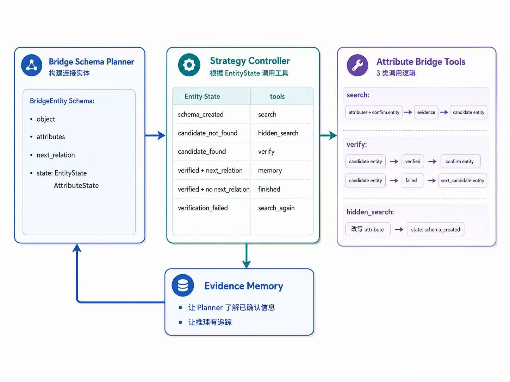

# HotpotQA Attribute-Constrained Hybrid Agent

本项目面向 HotpotQA 多跳问答任务，包含原始 Evidence-State baseline agent，以及一个改进后的 Attribute-Constrained Hybrid Agent。

核心思想是：对于 HotpotQA 中的 bridge 问题，与其直接寻找模糊的 `missing_information`，不如先明确推理链中缺失的连接对象，即 `Bridge Object`，再用多个属性约束共同定位和验证它。

## 总体思想：多属性约束驱动的 Bridge Object 推理

原始 baseline agent 采用的是**证据状态驱动的“检索与推理交错进行”的线性流程**。它在每一轮中先判断当前还缺少什么信息，然后根据这个缺失信息进行检索，再从检索到的证据中抽取事实或答案。

```text
missing_information -> search -> evidence -> extract fact/answer -> finish or continue
```

在 HotpotQA 的 bridge 问题中，推理过程往往并不总是一条简单的线性链：

```text
evidence A -> evidence B -> answer
```

很多问题更像是多个条件共同指向同一个中间对象：

```text
attribute 1 \
attribute 2  -> entity A -> entity B -> answer
attribute n /
```

也就是说，真正需要先确定的不是最终答案，也不只是某个模糊的 `missing_information`，而是推理链中的 **bridge object**。这个 **bridge object** 通常由多个属性共同约束。

实际上，相比直接确定一个问题的 `missing_information`，确定 `missing object` 往往更简单、更直观。

例如问题：

```text
Who is the director of the 2003 film which has scenes in it filmed at the Quality Cafe in Los Angeles?
```

可以很容易得到逻辑链：

```text
film -> director
```

这个 `film` 需要同时满足两个属性：

```text
attribute 1 = released in 2003
attribute 2 = has scenes filmed at Quality Cafe in Los Angeles
```

先确认这个 `film`，才能继续沿着逻辑链得到最终答案。

因此，我的方法不是直接搜索 `missing_information`，而是显式构建一个 `BridgeEntitySchema`，并通过更新 `BridgeEntitySchema` 来推进逻辑链。

它的核心表示是：

```json
{
  "object": "film",
  "attributes": [
    {
      "description": "released in 2003",
      "status": "unverified",
      "constraint_type": "hard"
    },
    {
      "description": "has scenes filmed at the Quality Cafe in Los Angeles",
      "status": "unverified",
      "constraint_type": "hard"
    }
  ],
  "candidate_entities": [],
  "confirmed_entity": null,
  "next_relation": "director",
  "state": "schema_created"
}
```

其中：

- `object` 表示要寻找的中间对象，例如 `film`、`person`、`company`。
- `attributes` 表示该对象必须满足的多个属性约束。
- `candidate_entities` 表示搜索得到但尚未验证的候选对象。
- `confirmed_entity` 表示经过属性验证后的连接对象。
- `next_relation` 表示确认该对象后要继续追踪的关系。
- `state` 表示当前对象处于创建、搜索、验证或完成状态。

## 框架结构

Bridge Agent 由四个核心模块组成：



各模块作用如下：

- `Bridge Schema Planner` 负责根据原始问题和当前 `Evidence Memory` 构建下一步要寻找的连接对象。
- `Strategy Controller` 是状态机调度模块，根据当前 `BridgeEntitySchema.state` 决定下一步应该调用哪个工具。
- `Attribute Bridge Tools` 负责执行具体工具操作，主要包含三类工具：
  - `search` 根据 schema 中的 `attributes` 检索证据，并从证据中抽取候选连接对象。
  - `verify` 检查候选对象是否真的满足 schema 中的属性约束。
  - `hidden_search` 处理普通搜索找不到候选对象的情况，尝试发现隐藏桥接关系。
- `Evidence Memory` 用于保存推理过程中已经确认的信息，使 Planner 能够基于已确认实体继续规划下一跳。

## 项目结构

项目现在包含三个主要组件：

```text
hotpotqa_agent/
  agent/          # 原始 Evidence-State baseline agent
  bridge/         # 属性约束驱动的 bridge reasoning agent
  comparison/     # 针对 comparison 问题的 agent
  core/           # 共享的 LLM、检索和状态工具
  data/           # HotpotQA 数据加载和样本查看工具
  router.py       # 问题类型判别器
```

## 创新点

### 1. 多属性共同约束 Bridge Object

在 HotpotQA 的 bridge 问题中，最终答案往往依赖一个中间连接实体。传统方法通常根据当前缺失信息直接进行检索，而本方法首先显式确定推理链中需要寻找的连接实体，即 `Bridge Object`。

我们将连接实体需要满足的实现条件整理为它的 `attributes`，并通过 `search` 和 `verify` 两个阶段驱动推理链：

```text
Bridge Object
-> attributes
-> search candidate entity
-> verify attributes
-> confirmed bridge entity
-> next relation
-> answer
```

也就是说，候选实体只有在满足多个属性约束后，才会被确认为推理链中的连接点。

### 2. Hidden Bridge Search

通过分析推理链可以发现，很多问题中存在隐藏的连接实体。这些实体通常不会在问题中被直接提示，但如果不先推理出它们，系统就无法沿着 planner 规划好的推理链继续推理。

例如：

```text
Question:
What nationality was James Henry Miller's wife?
```

Planner 可能规划出的表层推理链是：

```text
person -> nationality
```

但实际推理链应当是：

```text
stage name -> person -> nationality
```

因此，系统必须先发现隐藏桥接实体：

```text
James Henry Miller -> Ewan MacColl
```

然后才能继续推理：

```text
wife of Ewan MacColl -> Peggy Seeger -> nationality
```

基于这类现象，本项目设计了 `hidden_search` 工具，用于处理主体替换、主题包含关系等隐藏桥接情况。当普通搜索找不到候选实体时，`hidden_search` 会尝试发现隐藏连接实体，并改写 schema 中的 attributes，使推理链能够继续推进。

### 3. 更强的证据链

本方法得到的推理链更具逻辑性。系统会显式记录每一跳中的 `Bridge Object`、`attributes`、`candidate entity`、`confirmed entity` 和对应证据。

实验结果显示，本方法能够得到更高的 `support_f1` 和 `joint_f1`，说明多属性约束和属性级验证有助于构建更可靠的证据链。

## 环境配置

建议使用 conda：

```bash
conda create -n hotpot-agent python=3.11 -y
conda activate hotpot-agent
pip install -r requirements.txt
```

在项目根目录创建 `.env`：

```env
LLM_BASE_URL=https://api.siliconflow.cn/v1
LLM_API_KEY=your_api_key_here
LLM_MODEL=your_model_here
LLM_TEMPERATURE=0.2
LLM_MAX_TOKENS=1024
```

## 运行示例

### 运行原始 baseline agent

```bash
python examples/run_sample_agent.py --split train --sample-index 25 --max-hops 8
```

**Reasoning Trace**

| Hop | Action | Key Evidence | Extracted Fact |
|---|---|---|---|
| 1 | `search("2003 film scenes filmed at Quality Cafe Los Angeles")` | `Quality Cafe[0]`, `Quality Cafe (diner)[0]`, `Quality Cafe (jazz club)[0]` | Quality Cafe refers to former locations in Downtown Los Angeles. |
| 2 | `search("Old School 2003 filming locations Quality Cafe")` | `Quality Cafe (diner)[1]`, `Old School (film)[0]` | Old School is a 2003 film and Quality Cafe appears as one of its filming locations. |
| 3 | `search("Old School director")` | `Old School (film)[0]` | Old School was directed by Todd Phillips. |

### 运行 bridge agent

```bash
python examples/run_bridge_agent.py --split train --sample-index 25 --max-rounds 8
```

**Bridge Reasoning Trace**

| Round | Tool | State | Object | Attributes | Candidate / Confirmed Entity |
|---|---|---|---|---|---|
| 0 | - | `schema_created` | `film` | `released in 2003`; `has scenes filmed at the Quality Cafe in Los Angeles` | none |
| 1 | `search` | `candidate_found` | `film` | `released in 2003`; `has scenes filmed at the Quality Cafe in Los Angeles` | candidate: `Old School` |
| 2 | `verify` | `verified` | `film` | `released in 2003` -> `Old School (film)[0]`; `has scenes filmed at the Quality Cafe in Los Angeles` -> `Quality Cafe (diner)[1]` | confirmed: `Old School` |
| 2.next | `build_next_schema` | `schema_created` | `answer value for relation: director` | `director of Old School` | none |
| 3 | `search` | `candidate_found` | `answer value for relation: director` | `director of Old School` | candidate: `Todd Phillips` |
| 4 | `verify` | `verified` | `answer value for relation: director` | `director of Old School` -> `Old School (film)[0]` | confirmed: `Todd Phillips` |
| 5 | `finish` | `finished` | `answer value for relation: director` | `director of Old School` -> `Old School (film)[0]` | final answer: `Todd Phillips` |

## 评价指标

本项目从答案质量、证据质量和联合推理质量三个角度进行评测。

### 指标说明

| 指标 | 含义 |
|---|---|
| `answer_em` | Exact Match，预测答案与标准答案完全匹配的比例。 |
| `answer_f1` | 预测答案与标准答案之间的 token-level F1。 |
| `support_f1` | Supporting facts F1，用于衡量模型是否找到了正确证据。 |
| `joint_f1` | 同时考虑答案和 supporting facts 的联合 F1。 |
| `BLEU` | 预测答案与标准答案之间的 n-gram 相似度。 |
| `ROUGE-L` | 基于最长公共子序列的答案相似度。 |
| `METEOR` | 综合词形、召回和词序的生成相似度。 |

### 实验结果

以下结果基于 HotpotQA `train` split 中连续 50 条样本计算得到。

| Method | Answer EM | Answer F1 | Support F1 | Joint F1 | BLEU | ROUGE-L | METEOR |
|---|---:|---:|---:|---:|---:|---:|---:|
| Baseline Evidence-State Agent | 0.6400 | 0.7869 | 0.3082 | 0.2420 | 0.7904 | 0.7869 | 0.6853 |
| Attribute-Constrained Hybrid Agent | 0.6000 | 0.6707 | 0.6351 | 0.4981 | 0.7647 | 0.6707 | 0.5599 |

### 结果分析

从结果可以看出，baseline agent 在 answer-only 指标上表现更好：

```text
answer_em: 0.6400 -> 0.6000
answer_f1: 0.7869 -> 0.6707
```

而改进后的 Attribute-Constrained Hybrid Agent 在证据和联合推理指标上有明显提升：

```text
support_f1: 0.3082 -> 0.6351
joint_f1:   0.2420 -> 0.4981
```

这说明多属性约束和属性级验证机制能够更好地找到 supporting facts，并构建更可靠的多跳证据链。

因此，本方法并不是单纯追求最高答案匹配率，而是强调：

- 更结构化的 bridge object 推理
- 更强的 evidence grounding
- 更可解释的 multi-hop reasoning chain

总体来看，改进方法以少量 answer-only 指标下降为代价，显著提升了证据链质量和 joint reasoning 能力。
